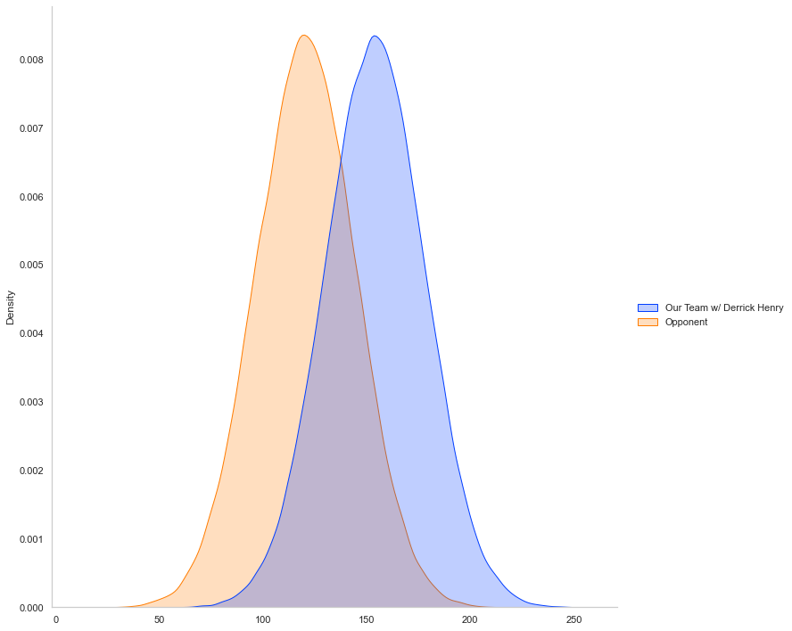
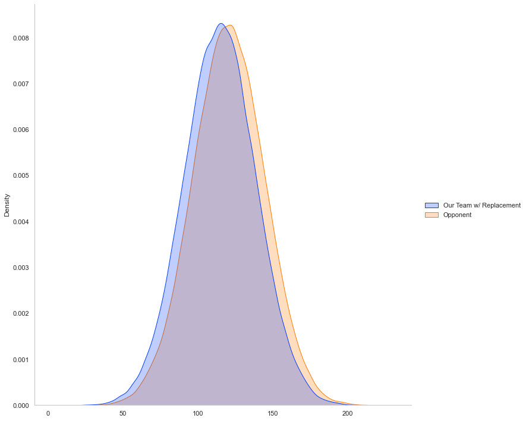
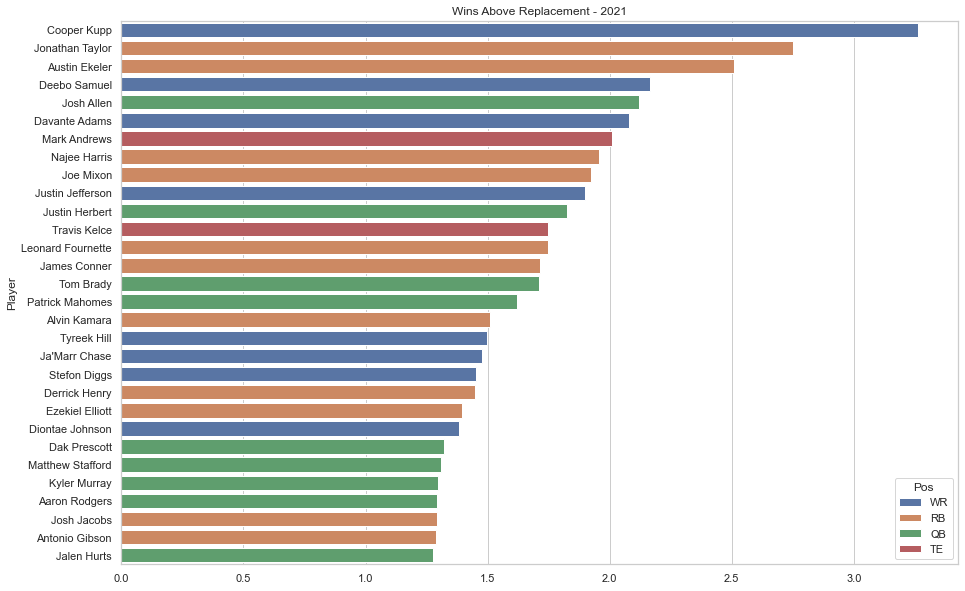
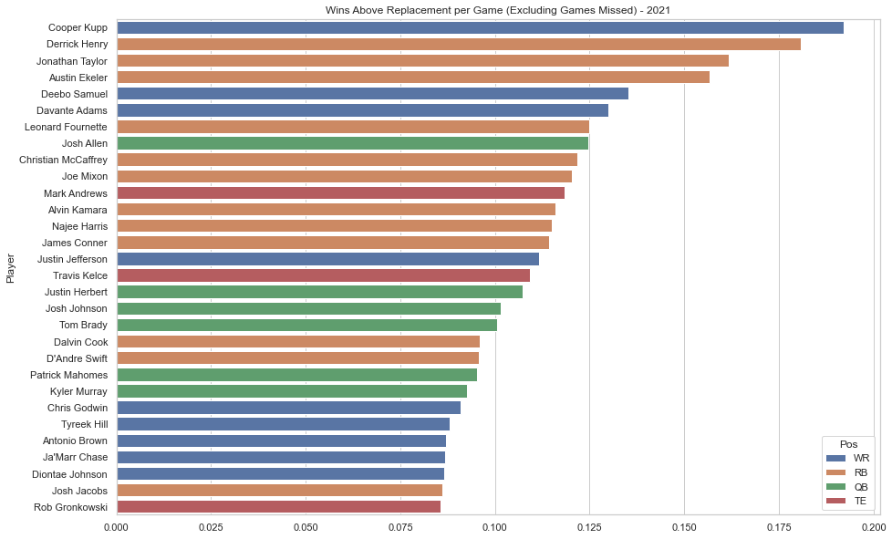

# Fantasy Football Analytics

This repository contains a collection of notebooks for various topics related to fantasy football. Currently, the following notebooks are completed:
* Wins above replacement for each player
* How does a running backs career snap count affect their performance

# Wins Above Replacement Player

Consider a week where one of your starters is on a bye or injured. You'll likely need to go to your bench, or worse, the barren waiver wire to replace them. Having this player in your lineup hurts your chances of winning by a noticeable margin. The wins above replacement metric is my attempt to capture this situation and provide a value on how much that missing starter means to your team. By comparing the performance of a player each week to what an equivalent replacement player would produce, we can determine how much more likely your team might win. 

Determining this value is difficult, however, because there can be so many different combinations of teams. In order to simplify the analysis, we'll need to control for the players performance by considering the rest of the team is made up of average starters. Similarily for the opponent, their entire team will be made up of average starters. By comparing the actual players performance to the average starter for that position, we can calculate how many more (or less) points your team would score compared to your opponent. A similar comparison can be run for a replacement player. 

### Example of the team distributions with Derrick Henry (week 2, 2021) as the control player

### Combined distributions to compute the win probability (x > 0)

In week 2, Derrick Henry went off for 48 points (PPR) while an average replacement RB would've only scored 9 points and an average starting RB would've only scored 15 points. Having Derrick Henry on your team likely gave you a 33 point advantage over your opponents RB. No wonder your teams winning percentage would've been 84% assuming we know nothing else about the rest of the team. 

### 2021 Most Valuable Players Measured by Wins Above Replacement

Cooper Kupp is without a doubt, the fantasy football MVP for 2021. His performance over the whole season added as much as 3 wins when compared to a replacement level player. Had Derrick Henry not suffered his foot injury, he looked primed to challenge Cooper Kupp for this throne.

